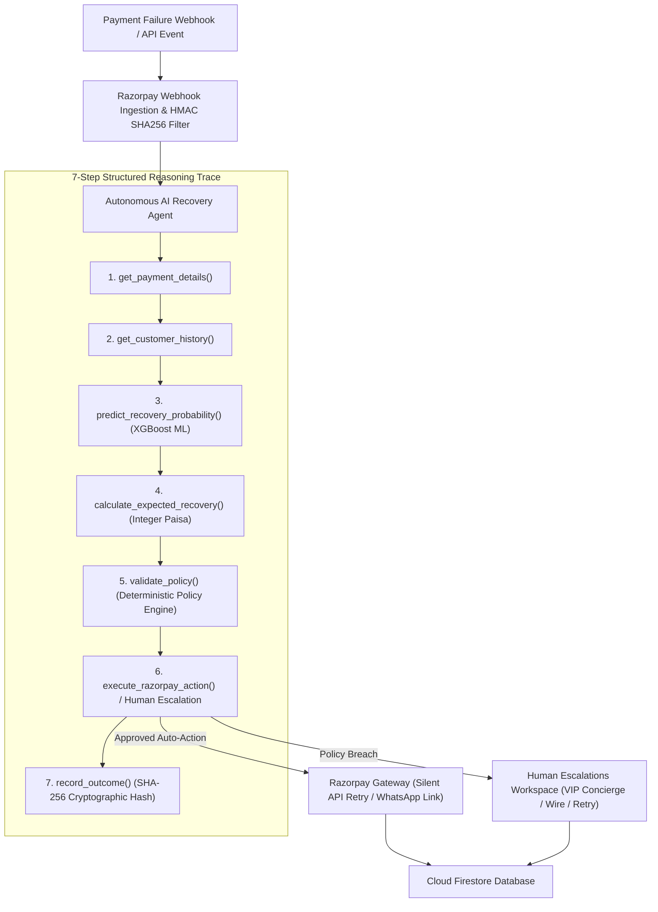

# RecoverPay AI — Autonomous Payment Recovery Engine

> **Razorpay AI Buildathon Submission — Track 03: Agentic AI for Payment Recovery**
>
> RecoverPay AI is an enterprise-grade autonomous payment recovery agent designed to intelligently diagnose transaction failure root causes, predict intervention win probabilities using an XGBoost classifier, validate actions against strict merchant safety policies, and execute optimal recovery workflows via Razorpay APIs.

---

## 🌐 Live Production Deployment URLs

| Service | Platform | Live URL | Status |
| :--- | :--- | :--- | :---: |
| **Frontend Web App** | **Firebase Hosting** | **[https://recoverpayai.web.app](https://recoverpayai.web.app/)** | 🟢 Live |
| **Production Backend API** | **Render.com** | **[https://recoverpay.onrender.com](https://recoverpay.onrender.com)** | 🟢 Live |
| **API Documentation (Swagger)** | **FastAPI Docs** | **[https://recoverpay.onrender.com/docs](https://recoverpay.onrender.com/docs)** | 🟢 Live |
| **API Health Check** | **Render.com** | **[https://recoverpay.onrender.com/api/health](https://recoverpay.onrender.com/api/health)** | 🟢 Live |
| **Demo Video Script** | **Documentation** | **[docs/demo_video_script.md](docs/demo_video_script.md)** | 🟢 Ready |

---

## 🌟 Executive Highlights

- **+203.02% Honest Revenue Recovery Uplift**: Empirically verified across 1,000 payment failure events using fair, symmetric simulation — AI path uses raw XGBoost predictions with no probability floor or boost (seed=99, reproducible). AI: **76.17% recovery rate** vs. Baseline: **25.14%**.
- **Three-Strategy Comparison**: Fixed Retry Baseline → Rule-Based Lookup → RecoverPay AI — demonstrating the model adds value beyond simple if/else heuristics.
- **8 Structured Agent Tools**: Operates strictly within type-safe boundaries (`get_payment_details`, `get_customer_history`, `predict_recovery_probability`, `calculate_expected_recovery`, `validate_policy`, `execute_razorpay_action`, `escalate_to_human`, `record_outcome`).
- **Deterministic Policy Engine with Industry Presets**: Hard business safety boundaries with 1-click presets for **SaaS Subscriptions**, **E-Commerce Retail**, **B2B High-Ticket**, and **Standard Balanced** models.
- **Interactive Omnichannel Customer Outreach**: Previews personalized WhatsApp Interactive, SMS, and Branded Email notifications with an embedded **1-Click Razorpay Checkout Gateway Simulation**.
- **Real-Time Recovery Queue Auto-Update**: Completing a payment via customer link or webhook instantly captures the transaction, clears the case from the queue, and updates recovered revenue in real-time.
- **Role-Based Access Control (RBAC)**: Strict permission gating across 3 distinct personas: **Merchant Admin**, **Operations Lead**, and **Compliance Auditor**.
- **Immutable SHA-256 Audit Trail**: Every AI tool call, webhook, and human override generates a cryptographically hashed, append-only log entry with CSV and Executive PDF export capabilities.

---

## 🏗️ System Architecture Overview



---

## 👥 Role-Based Access Control (RBAC) Matrix

| Feature / Action | 👑 Merchant Admin (`MERCHANT_ADMIN`) | 🛠️ Operations Lead (`OPERATIONS_LEAD`) | 🛡️ Compliance Auditor (`COMPLIANCE_AUDITOR`) |
| :--- | :---: | :---: | :---: |
| **View Dashboards, Benchmarks & ROI** | ✅ Allowed | ✅ Allowed | ✅ Allowed |
| **Inspect AI Reasoning & Decision Trees** | ✅ Allowed | ✅ Allowed | ✅ Allowed (Read-Only) |
| **View Immutable Audit Logs & Hashes** | ✅ Allowed | ✅ Allowed | ✅ Allowed |
| **Export CSV & Executive PDF Reports** | ✅ Allowed | ✅ Allowed | ✅ Allowed |
| **Execute AI Recovery Actions from Queue** | ✅ Allowed | ✅ Allowed | 🔒 **Locked** (Read-Only) |
| **Resolve Human Escalations (Triage)** | ✅ Allowed | ✅ Allowed | 🔒 **Locked** (Read-Only) |
| **Tune & Save Policy Engine Rules** | ✅ Allowed | 🔒 **Locked** (View Only) | 🔒 **Locked** (View Only) |
| **Inject Synthetic Failure Simulation Events** | ✅ Allowed | 🔒 **Locked** (Admin Only) | 🔒 **Locked** (Admin Only) |

---

## 🚀 Quick Start Guide

### Prerequisites
- Python 3.11+
- Node.js 18+ (for frontend)
- Docker & Docker Compose (Optional for containerized run)

### Option A: Local Development Setup

1. **Clone Repository & Setup Environment**:
   ```bash
   git clone https://github.com/RuteshReddyB/RecoverPay.git
   cd RecoverPay
   ```

2. **Install & Launch Backend API**:
   ```bash
   pip install -r requirements.txt
   python -m uvicorn backend.main:app --reload --port 8000
   ```
   *Backend interactive Swagger docs will be live at `http://127.0.0.1:8000/docs`.*

3. **Install & Launch Frontend Dashboard**:
   ```bash
   cd frontend
   npm install
   npm run dev
   ```
   *Frontend Control Center will be live at `http://localhost:5173`.*

---

### Option B: One-Command Docker Deployment

Launch backend (`:8010`) and frontend (`:5174`) using Docker Compose:

```bash
docker compose up --build -d
```

---

## 📊 Verified 1,000-Event Benchmark Performance

We ran a batch evaluation across **1,000 payment failure events** (seed=99, reproducible) comparing three strategies head-to-head across the exact same event pool:

| Metric | Fixed Retry Baseline | Rule-Based Lookup | RecoverPay AI | AI vs Baseline |
| :--- | :--- | :--- | :--- | :--- |
| **Total Revenue at Risk** | ₹1.27 Crore | ₹1.27 Crore | ₹1.27 Crore | Same pool |
| **Total Revenue Recovered** | **₹32,034** | **₹83,431** | **₹97,070** | **+₹65,037** |
| **Recovery Rate %** | **25.14%** | **65.46%** | **76.17%** | **+51.03% Absolute Gain** |
| **Revenue Uplift %** | Ref Baseline | +160.4% vs Baseline | **+203.02% vs Baseline** | **ML outperforms both** |
| **AI vs Rule-Based Uplift** | — | Ref Rule-Based | **+16.35% vs Rule-Based** | **ML adds value over heuristics** |
| **Avoided Doomed Retries** | 0 | Partial | **Full avoidance** | Card issuer ban prevention |
| **Human Escalations** | 0 | 0 | **Triggered at >₹10k** | Strict safety cap enforced |

---

## 🧪 Automated Verification & Testing

Run all **67 automated backend unit, integration, and security tests**:

```bash
python -m pytest tests/ -v
```

Run frontend production build verification:

```bash
cd frontend
npm run build
```

---

## 📁 Repository Directory Structure

```text
RecoverPay/
├── backend/
│   ├── agents/          # Autonomous Agent Engine (recovery_agent.py) with Adaptive Retry Loop
│   ├── api/             # FastAPI REST Routers (prediction, recovery, webhooks, auth, simulator, policy, export)
│   ├── db/              # Firebase Firestore SDK & Mock Runner (firebase.py)
│   ├── evaluation/      # 1,000-Event Batch Evaluator — 3-Strategy Honest Comparison
│   ├── ml/              # XGBoost ML Model, SHAP Explainability & Predictor Pipeline
│   ├── policies/        # Deterministic Policy Engine & Industry Presets (policy_engine.py)
│   ├── schemas/         # Pydantic Data Models (customer, payment, recovery, policy, escalation, audit)
│   ├── services/        # Business Logic Repositories, Notification Client & Razorpay SDK Client
│   ├── tools/           # 8 Typed Agent Tool Definitions (recovery_tools.py)
│   └── utils/           # Integer Paisa Math, Masking & HMAC SHA256 Signature Security
├── data/                # 75,000 Synthetic Dataset & Seeded Generator
├── docs/                # Architecture Specs, API Contracts & Demo Video Script (demo_video_script.md)
├── frontend/            # React + TypeScript + Vite + Tailwind Control Center
│   ├── src/components/  # Dashboard, Modals (Checkout, Simulator, Policy, Escalation), Drawer & Charts
│   └── src/context/     # Auth Context (RBAC) & Theme Context (Dark/Light Mode)
├── models/              # Saved XGBoost Model, Benchmark Report & Split Metadata
├── tests/               # 67 Automated Pytest Unit, Integration & Security Tests
├── Dockerfile.backend   # Backend Container Config (Cloud Run / Docker)
├── Dockerfile.frontend  # Frontend Nginx Container Config
├── firebase.json        # Firebase Hosting Configuration
├── render.yaml          # Render.com 1-Click Deployment Blueprint
└── docker-compose.yml   # Multi-Container Compose Config
```

---

## 🔐 Security & Compliance

- **PII Masking**: Customer emails (`j***n@example.com`) and phone numbers (`+91******3210`) are redacted before logging or displaying in accordance with DPDP regulations.
- **Integer Paisa Math**: All monetary calculations use Integer Paisa (`₹4,999.00` = `499900 paisa`) ensuring **0% floating-point precision error**.
- **Cryptographic Audit Trail**: Every decision generates an immutable audit log entry with SHA-256 event checksums.
- **HMAC Signature Verification**: Webhook receiver verifies Razorpay HMAC SHA256 signatures in constant time with duplicate `event_id` idempotency rejection.

---

## 🏆 Razorpay Buildathon Submission Summary

- **Track**: Track 03 — Agentic AI for Payment Recovery
- **Repository**: [GitHub - RuteshReddyB/RecoverPay](https://github.com/RuteshReddyB/RecoverPay)
- **Live Demo**: [https://recoverpayai.web.app](https://recoverpayai.web.app/)
- **Live Backend API**: [https://recoverpay.onrender.com](https://recoverpay.onrender.com)
- **Video Demonstration Script**: [docs/demo_video_script.md](docs/demo_video_script.md)
- **Primary Innovation**: 8-Tool Autonomous Agent + XGBoost Expected Value Optimization + Deterministic Policy Engine with Industry Presets + Omnichannel Outreach with 1-Click Razorpay Checkout + Human Escalation Workspace + Immutable Cryptographic Audit Trail + Role-Based Access Control.